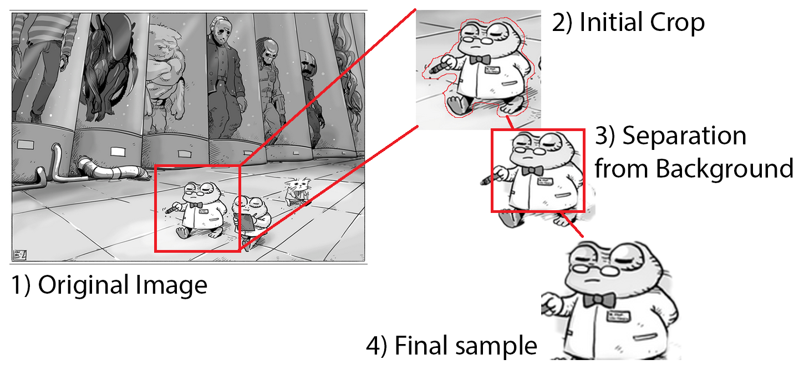

# FrogGAN

> A simple PyTorch Implementation of DCGANs for creating images of drawn frogs in the style of an Austrian artist.

## Abstract

Art can be understood by everyone and transcends boundaries in society. 
Sometimes art can become a part of your everyday life and seeing a couple of drawn, cute frogs on Reddit related to 
current events every Wednesday kinda makes you happy. Sometimes, you realize that drawing is hard, 
but would still like to create content like it...

To this end, I implemented _deep convolutional generative adversarial networks_ (DCGANs) in _PyTorch_ 
to create images of drawn frogs in the style of the Austrian artist 
[ManBroDude](https://manbrodude.art/) aka [smalllebowsky](https://www.reddit.com/user/SmallLebowsky/) on _Reddit_.

The target dataset was of small size (< 500 images with large variety) and to compensate, I pre-trained the networks on 
a larger dataset of Japanese style comic faces (about 110k images) using transfer learning before adjusting all layers 
during fine-tuning. From multiple tried training approaches, label smoothing yielded the best results. For 
hyper parameter optimization, _Frechet-Inception-Distance_ (FID) was used as objective value.
Experimental data augmentations (segmentation of object with and without background) together with regular data 
augmentations (randomized crops, flips, rotations, shearing, brightness and contrast fluctuations) have been applied.

The target dataset was generated by myself using screen cropping tools and Adobe Photoshop. Due to copyright reasons,
the dataset cannot be shared.
For the pre-training, I used the _anime faces_ dataset from Jie Lei's [animeGAN](https://github.com/jayleicn/animeGAN)
project.

The project is completed for the time being, as I am waiting for more content to be created by the artist to re-try it
in the future with a larger dataset to obtain better results.

## Results

Here are a few of my favourite creations:

These and the ones (including the nightmare sample) shown below were selected from about 400 generated images.
Most of them are of lesser quality. The DCGAN output resembles the original art, however, it fails to achieve 
convincing results. _Creativity_ and inference from the network are there, however, signs of over-fitting, i.e. plainly
reproducing parts of the original dataset, are present as well. 

Personally, I am not satisfied with the results, but I am looking forward to trying it again with a larger dataset in the future. 
After struggling to train the GAN initially, where I would have been happy with anything having frog-like eyes, I am content. 
I like how it sometimes mixes vertical and horizontal pupils to create some sort of heterochromia in
the frogs. 
I also like the frog "La rana Emmanuel" (above image, last row, second from the left).

Here are a few results that resemble content from a frog-ish nightmare rather than the original art (hand-picked). 
These are far more representative of the final GAN output than the selected 30 images above:

Sample output (raw, without cherry-picking) of the DCGAN after 50 epochs on the anime faces dataset before training
on the frog dataset. The difference in quality highlights the importance of a large dataset, or rather how that can 
simplify the process. The pre-training and therefore the output below was done without any further adjustments. 
The quality could have been definitely better, however, I did not think it would improve the final result from the 
target dataset and therefore did not attempt it in the first place.

Should one be interested in using GANs to create anime faces, I would recommend the above-mentioned 
[animeGAN](https://github.com/jayleicn/animeGAN) project.

## Article

As mentioned above, the goal was to create drawn frogs similar to the ones created by the artist [ManBroDude](https://manbrodude.art/).
I'm a fan and thought it would be a challenge to train a GAN on a small dataset of just under 500 images with a large variety.
The frogs are of different sizes, different poses, different clothing, different drawing tools and even different styles 
(e.g. considering early posted frogs from 3 years ago). 

I also wanted a GitHub profile picture of one of these frogs, but could not draw a good one myself.
  
### Hyper parameters

I used the same architecture from the [PyTorch DCGAN example](https://pytorch.org/tutorials/beginner/dcgan_faces_tutorial.html)
for the discriminator and generator:

- Generator: 5 layers with transposed convolutions, batch normalization, ReLUs as activation 
 as well as a Tanh function for the final layer.
- Discriminator: 5 layers with transposed convolutions, batch normalization and leaky ReLUs (0.2 gradient) as activation 
as well as a Sigmoid function for the final layer.
  
Adam was the optimizer of choice, and the explicit parameters can be found in the code. 

Different data augmentations were tried - they will be discussed in the next section. 
Before optimizing the hyper parameters, the defaults from the PyTorch example were used to try different training techniques.
Early training suffered from severe mode collapse and to mitigate this, the learning rates for the generator 
and discriminator were increased and decreased respectively. This improved the results, but only with limited success. 
Adding noise to the discriminator input with a linear annealing schedule to the noise variance as suggested in papers and articles 
(see references at the end) did not yield satisfying results.
Introducing a threshold for generator and discriminator loss, where either would only be trained if above the threshold, only caused unstable training 
results or had little effect to begin with. 

Label smoothing worked rather well, especially when fine-tuning the learning rate and batch size during the hyper parameter search.
It enabled the system to train longer and achieve better results.

To compare the different methods above, an objective value was required, as comparing results by eye is tedious. 
The Frechet-Inception-Distance was chosen, which uses the feature extraction of the Inception-V3 network and 
calculates the difference from a real and a generated fake batch. The lower the score, the closer are the two batches.
The implemented FID calculation code from [GitHub](https://github.com/mseitzer/pytorch-fid) was used.

For the hyper parameter search, the _Optuna_ Python package was used. The most relevant parameters were (in order),

- learning rate
- batch size
- label smoothing parameter

The significance of the latter increased, the closer the system got to the optimum.

### Datasets and Augmentations

Original image from [ManBroDude](https://manbrodude.art/)

The frog dataset was obtained by cropped screenshotting and using photoshop to segment the background from the original motive.
The resulting frogs were cropped again, to only focus on the frog faces and torsos, in an effort to improve the quality of the output.
Initially, all datasets were used together as a specific cropping augmentation. However, 
towards the end of the project, all have been dropped, but the frog faces.
The first approach yielded better results in terms of general body shape of the output frogs, however, the faces themselves were blurry at best.

The images were resized and turned into grayscale tensors of dimensions 64x64x1, as almost all the frog pictures are in 
black and white and colour parameters would not hold any valuable information, 
as colour differences are only due to quality fluctuations of the original posts.

For all datasets, random horizontal flips were applied. For the anime faces dataset, 
no further augmentations were implemented.

To enlarge the variety of the frog dataset, different augmentations were tried. In the end, 
only a random rotation up to +- 15 degrees, random shearing by a factor of up to 5, 
random resizing between 80% and 100% of the original size and random contrast and brightness fluctuations were applied.

### Training

The final FID scores achieved after the pre-training on the anime faces dataset were 144.11 +- 4.24 after 48 Epochs
and for the final frog dataset 138.16 +- 2.17 after 2499 epochs. 

As the optimal batch size was 238, the last batch of the frog dataset would have been comparably small, causing noisy update steps, hence I decided to drop it. 

### References, Papers and Articles

For anyone interested, here are a few links to papers and articles that have helped me 
during this project and from which I've learned a lot.

I've started from the [PyTorch DCGAN example](https://pytorch.org/tutorials/beginner/dcgan_faces_tutorial.html),
but only used the code fragments and started right off with a different dataset. 
I would recommend the following two links from the same site:

- [GitHub](https://github.com/soumith/ganhacks) useful GAN training hacks
- [GitHub](https://github.com/nashory/gans-awesome-applications) list of cool GAN applications

Found while working on this project and worth reading:

- [Article](https://towardsdatascience.com/gan-ways-to-improve-gan-performance-acf37f9f59b)
  for different ways to improve GAN performance
- [Article](https://www.inference.vc/instance-noise-a-trick-for-stabilising-gan-training/)
  on using instance noise during GAN training
- [Paper](https://openaccess.thecvf.com/content_CVPR_2019/papers/Jenni_On_Stabilizing_Generative_Adversarial_Training_With_Noise_CVPR_2019_paper.pdf)
  on using noise during GAN training
- [Paper](https://arxiv.org/abs/1706.08500) introducing Frechet-Inception-Distance (FID) as measure
- FID score fore PyTorch [GitHub](https://github.com/mseitzer/pytorch-fid) which I've used as well
- Hyper parameter search [paper](https://assets.researchsquare.com/files/rs-95571/v1_stamped.pdf)
- Transfer learning for GANs 
  [paper](https://openaccess.thecvf.com/content_ECCV_2018/papers/yaxing_wang_Transferring_GANs_generating_ECCV_2018_paper.pdf)

Reference
[This person does not exist](https://thispersondoesnotexist.com/)

## Usage

This project is very much WIP and changes are constantly being made. The project is being run on Google Colab and at the moment, 
only back-end modules are uploaded here.

A final, minimized jupyter notebook with all essentials together with the final models  will be uploaded here as well.

## License
[MIT](https://choosealicense.com/licenses/mit/)